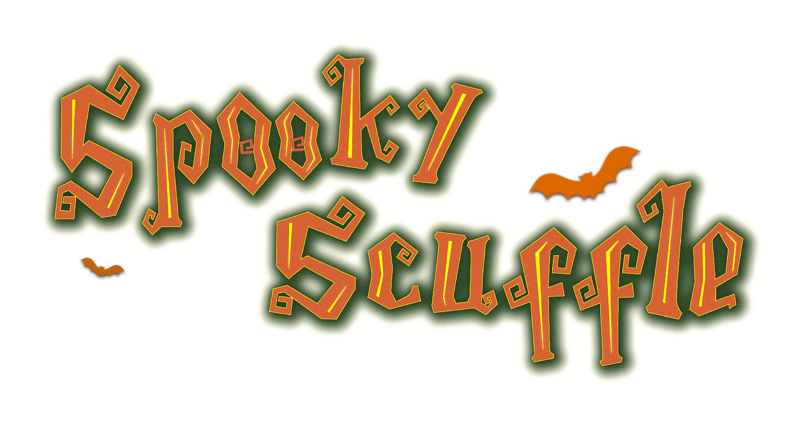

# Toopie

-----

> Programmers :
> Antony GAVELLE
> Theo RITOUNI
> Designers :
> Jeremy BECICA
> Lisa JAUGEY
> Alice DOUSSIN
> Guillaume FOSSIER

## Description :

Realization of a 3D Brawler on Unreal Engine 4 with a team of 6 (2 Game Programmer and 4 Game Designer).
I was mainly in charge of the AI and the combat system (combo, special attack, transformation, ...) and the implementation of animations.

You play a vampire trying to reach his castle. Attack the enemies with your swords, dodge their attacks, transform yourself into a bat and absorb their blood to regain life. Beware of the sun, stay in the shade to avoid being fried on the spot.

